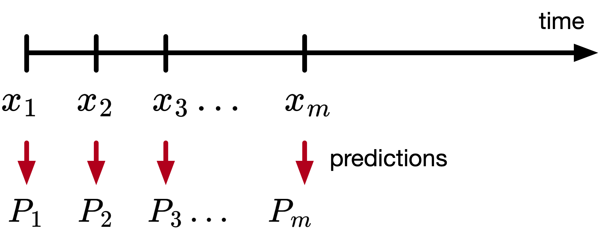
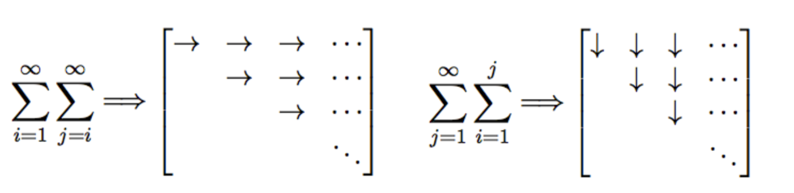

# Temporal Difference (TD) Learning

I provide some notes on the paper. For a deeper understanding, I highly recommend reading the original work [[1]](#references), as these notes serve only as a concise summary highlighting the main ideas for didactic purposes. Some parts are quoted verbatim from the paper.

- [Overview](#overview)
- [Methods](#methods)
- [TD(λ)](#tdλ)
- [Theory of TD methods](#theory-of-td-methods)
- [Related research](#related-research)
- [Some personal views](#some-personal-views)
- [References](#references)

## Overview

Temporal-difference learning methods are incremental learning procedures specialized for prediction problems.

**Conventional prediction-learning methods** are driven by the error between predicted and actual outcome.  
**Idea:** we wait for the final outcome to compute the error.

**TD methods** are driven by the error or difference between temporally successive predictions.  
**Idea:** we update before the final outcome is known.

## Methods

Let there be a sequence of observations 
$$x_1, x_2, \ldots, x_m,$$
with 
$$x_1, \ldots, x_m \in \mathbb{R}^n,$$
and let the outcome of the sequence be 
$$z \in \mathbb{R},$$
a scalar, and 
$$P_1, P_2, \ldots, P_m$$
are estimates of $$z,$$
also a function of $$w$$ (i.e., $$P(x_t, w)$$), as shown in the figure below.

{: width="400px" .center}

**Rules for updating $$w$$:**
- for each observation, an increment to $$w$$, denoted $$\Delta w$$ is determined.
- after a complete sequence is processed, $$w$$ is changed by the sum of all sequence increments

$$w = w + \sum_{t=1}^m \Delta w_t.$$

In **supervised learning**, we treat each sequence of observations and its outcome as a sequence of observation-outcome pairs 
$$(x_1, z), (x_2, z), \ldots, (x_m, z).$$

The optimization problem being solved is 

$$\mathcal{L} = \sum_{t=1}^m (P(w, x_t) - z)^2,$$

As is standard in optimization, the parameter update relies on computing the gradient of this loss with respect to the model parameters $$w$$ as follows

$$\nabla_w \mathcal{L} = \sum_{t=1}^m 2 (P(w, x_t) - z) \nabla_w P(w, x_t),$$

and using this gradient in the update rule

$$\begin{aligned}
w &= w - \alpha \nabla_w \mathcal{L}, \\
w &= w + 2 (z - P(w, x_t)) \nabla_w P(w, x_t).
\end{aligned}$$

Note that the update rule depends on $$z$$, so we need to wait until the end of the sequence.
 
It is straightforward to derive the law above in case of linear functions (i.e., $$P(w, x_t) = w^\top x_t$$. The increment in this case is

$$\Delta w_t=\alpha\left(z-w^\top x_t\right) x_t,$$

which is the Widrow-Hoff rule.

**Remark:** If $$P_t$$ is more complicated, like a DNN, we use the same rule, just that computing the quantity $$\nabla_w P$$ is more involved. That's where libraries like PyTorch are nice and useful.

There is an **alternative**: A TD procedure that produces the same result.  
We can represent the error

$$z - P_t = \sum_{k=t}^m (P_{k+1} - P_k), \text{where } P_{m+1} = z.$$

The relationship above is straightforward to see if we write the sum explicitly and cancel the terms.  
The rule is thus

$$\Delta w_t=\alpha\left(P_{t+1}-P_t\right) \sum_{k=1}^t \nabla_w P_k.$$

This law is called TD(1). The paper shows how this rule is derived.

**Proof:**  
We are following the proof as presented in the paper, with additional clarifications. The proof itself is straightforward, but careful attention to the indices is essential.

$$\begin{aligned}
w & \leftarrow w + \sum_{t=1}^m \alpha\left(z-P_t\right) \nabla_w P_t,  \\
w & \leftarrow w + \sum_{t=1}^m \alpha \sum_{k=t}^m\left(P_{k+1}-P_k\right)\nabla_w P_t, \\
w & \leftarrow w+\sum_{k=1}^m \alpha \sum_{t=1}^k\left(P_{k+1}-P_k\right) \nabla_w P_t,
\end{aligned}$$

where in the last part we swapped the summation. A nice visualization of this summation is shown below.

{: width="400px" .center}

Then, the update rule becomes 

$$w \leftarrow w+\sum_{t=1}^m \alpha\left(P_{t+1}-P_t\right) \sum_{k=1}^t \nabla_w P_k.$$

## TD($$\lambda$$)

Considers a class of TD procedures that make greater alterations to more recent predictions

$$\Delta w_t=\alpha\left(P_{t+1}-P_t\right) \sum_{k=1}^t \lambda^{t-k} \nabla_w P_k,$$

where $$0\leq\lambda\leq1$$.  

### Summary
----------------------------------------

| Method | Update Rule |
|--------|-------------|
| **TD(0)** | $$\Delta w_t=\alpha\left(P_{t+1}-P_t\right) \nabla_w P_t$$ |
| **TD(1)** | $$\Delta w_t=\alpha\left(P_{t+1}-P_t\right) \sum_{k=1}^t \nabla_w P_k$$ |
| **TD($$\lambda$$)** | $$\Delta w_t=\alpha\left(P_{t+1}-P_t\right) \sum_{k=1}^t \lambda^{t-k} \nabla_w P_k$$ |

-----------------------------------------

## Theory of TD methods

Two results: (1) an asymptotic convergence theorem for linear TD(0) when presented with new data sequences, (2) a theorem that linear TD(0) converges under repeated presentations to the optimal.  
The proofs use the Theory of Stochastic Approximations.

Initially, I intended to include more detailed notes on the proofs; however, as I am still assimilating the underlying theoretical framework, I chose to refrain from providing incomplete or potentially inaccurate commentary.

For the convergence proof, the theory is generated for data sequences generating by absorbing Markov processes, such as a random-walk process. "Absorbing" means that all sequences eventually terminate.  
We call $$T$$ a set of terminal states, $$N$$ a set of nonterminal states, and $$p_{ij}$$ a set of transition probabilities.  
The state update is 

$$X_{t+1}= \begin{cases}X_t, & X_t \in T \\ \text { random draw with } P\left(X_{t+1}=j \mid X_t=i\right)=p_{i j}, & X_t=i \in N\end{cases}$$

Below, I show a picture of such a process.

{: width="800px" .center}

The proof shows that the expected values of the predictions found by linear TD(0) converge to the ideal predictions for data sequences generated by absorbing Markov processes.

The second part of the analysis examines which approach converges faster: temporal-difference (TD) methods or supervised learning. While both are guaranteed to converge asymptotically, the question is which one is faster? Answer: empirical evidence shows that TD converges faster.

One interesting result that I found is the following: "a common training process is to present a finite amount of data over and over again until the learning process converges. We prove that linear TD(0) converges under this repeated presentations training paradigm to the optimal predictions, while supervised-learning procedures converge to sub-optimal predictions. Since they are stepping toward a better final result, it makes sense that they would also be better after the first step."

## Related research

One aspect that I was wondering about while reading the paper is how does the theory extend outside episodic (finite) processes. For example, the paper shows the theory for an absorbing random walk (i.e., one that ends eventually).  
This is actually talked about in Section 6.4 in the paper. 

Suppose you wish to predict the total return from investing in stock of various companies. The problem is that if a company never goes out of business, than the total return can be infinite (because it earns income every year). So typically, these infinite-horizon problems include some form of discounting factors.  
We want $$P_t$$ to predict the discounted sum

$$P_t=\sum_{k=0}^{\infty} \gamma^k c_{t+k+1} = c_{t+1} + \gamma \sum_{k=0}^{\infty} \gamma^k c_{t+k+2} = c_{t+1} + \gamma P_{t+1}$$

The TD error is $$\left(c_{t+1}+\gamma P_{t+1}\right)-P_t$$. I am sure this is familiar to researchers doing deep RL.

## Some personal views

Reading this paper helped clarify several points that I was somewhat familiar with but had not fully internalized. For example, I now see more clearly that PPO uses TD learning for estimating the advantage function (thanks to Kris for pointing this out).

I would like to explore more rigorously how TD learning relates to adaptive control, since both frameworks rely on iterative update laws.

## References

[1] R. S. Sutton, "Learning to Predict by the Methods of Temporal Differences," Machine Learning, 1988.

[2] R. S. Sutton and A. G. Barto, "Reinforcement Learning: An Introduction," MIT Press, 2018.
