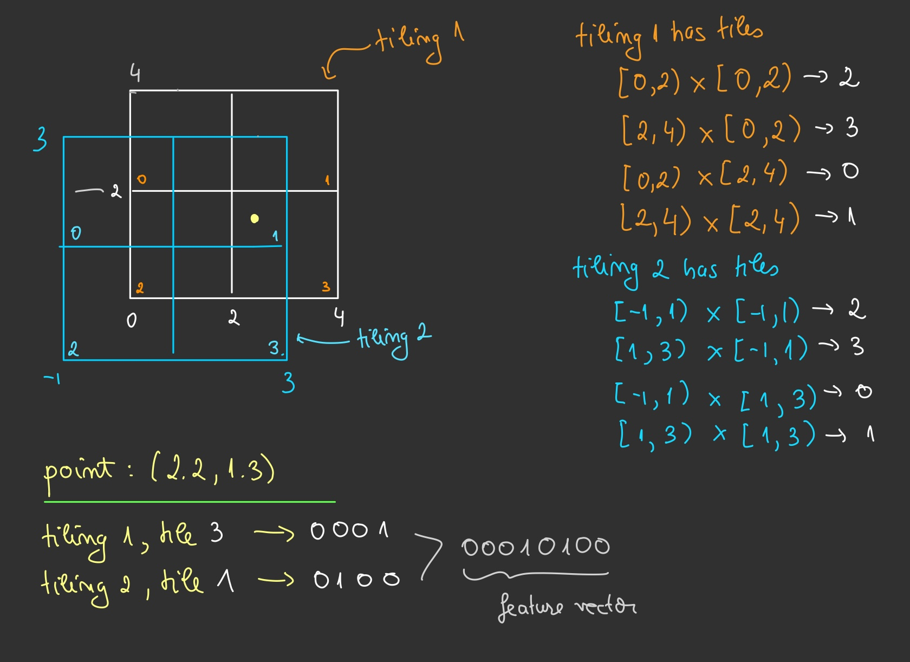

# Tile coding for action-value functions.

## Introduction

Tile coding is a technique used to represent multi-dimensional continuous spaces.  

The space is covered by multiple overlapping **tilings** or grids.
Tilings are offset from one another by a uniform amount in each dimension. Each tiling partition is a **tile**.
A state is represented by the set of tiles it falls into across all tilings. 
This representation produces a sparse, binary feature vector, which is both memory-efficient and computationally efficient for moderate-dimensional problems.

## Tile Coding Example

The figure below illustrates the concept:

{: width="500px" .center}

For practical implementations, see [tilecoding](https://github.com/MeepMoop/tilecoding) and [tile3](http://incompleteideas.net/tiles/tiles3.html).

## Pros and Cons

Here are the main strengths and limitations of tile coding:

**Advantages:**
- Well-suited for linear function approximation.
- Simple to implement.
- Only a small number of features are active at any time, so computationally efficient.
- Compared to artificial neural networks, tile coding is more stable and less sensitive to hyperparameters.
- Because the features are indicator functions of overlapping tiles, the linear combination of them can approximate nonlinear functions of the raw state.

**Disadvantages:**
- The number of tiles grows with the number of state dimensions. For example, representing a humanoid robot with many degrees of freedom would require a very large number of tiles.
- Has a fixed representation of the state space. Once the tilings are set, the feature map is static.

## Linear Function Approximation

Consider the state-value function $$V(s_t, \mathbf{w})$$ with feature vector $$\boldsymbol{\phi}(s_t)$$.  
It can be represented as a linear combination of features, as follows

$$
V(s_t, \mathbf{w}) = \mathbf{w}^\top \boldsymbol{\phi}(s_t), \quad \text{where} \quad \boldsymbol{\phi}(s_t) \in \{0, 1\}^n \quad \text{and} \quad \mathbf{w} \in \mathbb{R}^n.
$$

For **stochastic gradient descent (SGD)**, the update rule is

$$
\mathbf{w}_{t+1} \leftarrow \mathbf{w}_t + \alpha(U_t - V(s_t, \mathbf{w}_t)) \boldsymbol{\phi}(s_t),
$$

where $$U_t$$ is the target value and $$\alpha$$ is the step size.

For **temporal-difference (TD) learning**, the update becomes

$$
\mathbf{w}_{t+1} \leftarrow \mathbf{w}_t + \alpha(R_{t+1} + \gamma \mathbf{w}^\top \boldsymbol{\phi}(s_{t+1}) - \mathbf{w}^\top \boldsymbol{\phi}(s_t)) \boldsymbol{\phi}(s_t),
$$

where $$R_{t+1}$$ is the reward at time $$t+1$$, $$\gamma$$ is the discount factor, and $$s_{t+1}$$ is the next state.

## SARSA with Tile Coding

Now consider SARSA, with an action-value function $$Q(s, a)$$.  
A natural choice of features is $$\boldsymbol{\phi}(s, a)$$. 
Suppose we have discrete actions $$a \in \{1, 2, \ldots, K\}$$.  
The action-value function can then be expressed as

$$
Q(s, a, \mathbf{w}) = \mathbf{w}_a^\top \boldsymbol{\phi}(s), \quad \text{where} \quad \mathbf{w}_a \in \mathbb{R}^n,
$$

and the full weight matrix $$\mathbf{w}$$ has shape $$K \times n$$.  

Since $$\boldsymbol{\phi}(s)$$ is a binary vector (and thus sparse), the action-value function can be computed as

$$
Q(s, a)=\sum_{i \in \text { active tiles }} \mathbf{w}_{a, i} \quad \text { for all } a=1, \ldots, K.
$$

The greedy action is chosen as

$$
a^*=\arg \max _{a \in\{1, \ldots, K\}} Q(s, a),
$$

**Note:** Always break ties randomly to avoid bias.

## Connections to Brain-inspired Approaches.

There's actually a well-known connection between tile coding and how the brain may represent space.
Here's a link to a [wikipedia page](https://en.wikipedia.org/wiki/Cerebellar_model_articulation_controller).

## Conclusion

In summary, tile coding is a simple and efficient way to represent continuous spaces with sparse, binary feature vectors.
However, this efficiency comes with limitations: the number of tiles increases with the dimensionality of the state space, which makes the method less practical for very high-dimensional problems.

## References

[1] R. S. Sutton and A. G. Barto, "Reinforcement Learning: An Introduction," MIT Press, 2018.

